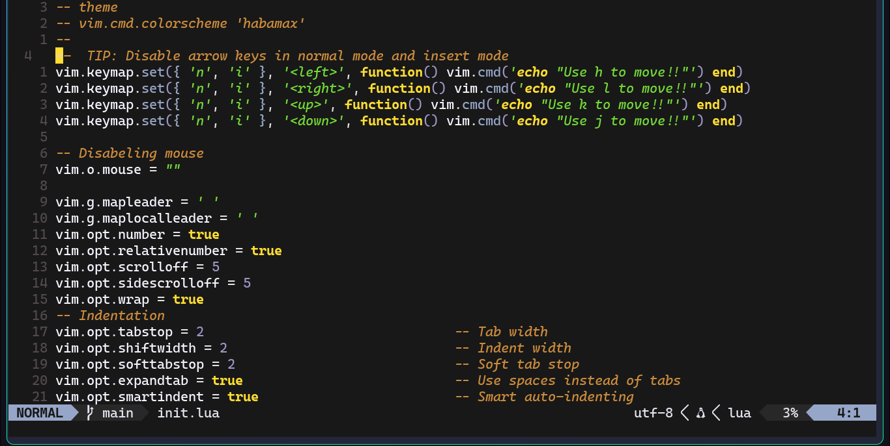
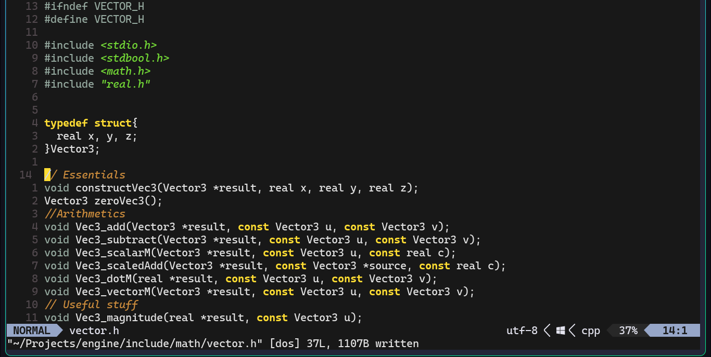

# NeoGruber - My Neovim Configuration

A simple, lightweight Neovim config with manual plugin setups and custom keymaps, optimized for efficient editing and navigation.

#Preview


---

## Features

- **Theme:** Uses the `gruber-darker` colorscheme by default. Optionally switch to `catppuccin-mocha`.
- **Keymaps:**
  - Arrow keys disabled in normal and insert modes to promote use of `hjkl`.
  - Custom leader key (`Space`) shortcuts for file browsing, buffer switching, searching, and more.
- **Visuals:**
  - Relative and absolute line numbers enabled.
  - 24-bit true color support.
  - Sign column always visible.
  - Matching bracket highlights.
- **Editing:**
  - 2-space indentation with smart indent and soft tab stops.
  - Mouse support disabled for keyboard-centric workflow.
  - No backup, swap, or undo files created.
- **LSP Setup:**
  - Example manual setup included (e.g., Pyright) — can be customized or extended.
- **Plugins:**
  - `Comment.nvim` for easy toggling of code comments.
  - `lualine.nvim` for a sleek statusline.
  - `fzf.vim` for fuzzy finding files, buffers, and more.

---

## Installation

Simply clone this repo to your Neovim config directory:

```bash
git clone --recursive https://github.com/segfaulted67/neogruber.git ~/.config/nvim
